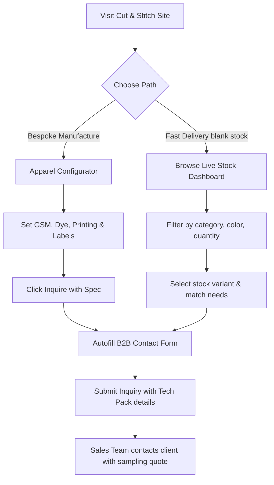

# Cut & Stitch — Premium Bespoke Apparel Platform

Cut & Stitch (`cutn-stitch`) is a premium B2B custom clothing and apparel manufacturing storefront. It bridges the gap between digital custom specifications and bulk industrial garment manufacturing by serving as a digital showroom, interactive spec configurator, and inquiry generation pipeline for fashion brands, startups, corporate identity programs, and uniform needs.

---

## 🎯 The Core Idea

The platform acts as a digital **Tech-Pack Generator and Wholesale Lead Funnel**. Instead of dealing with lengthy offline consultations or complex spreadsheets, clients visualize garment customizations online, choose precise manufacturing metrics (dyes, fibers, GSM weight, print methods, labeling), and instantly generate inquiries tied directly to custom B2B manufacturing specifications. In addition, a real-time **Live Stock Inventory** system allows buyers to skip manufacturing lead times by ordering custom branding on pre-woven blank stocks.

---

## ✨ Key Features

### 🛠️ Interactive Apparel Configurator (`Customizer`)
*   **Vector Rendering & Simulation**: Dynamic SVG-based apparel previews that change color immediately based on chosen dye swatches.
*   **Production Spec Controls**: Customize five core textile indicators:
    1.  *Garment Style*: Toggle between styles (e.g., Oversized T-Shirt vs. Classic Polo).
    2.  *Fabric Density*: Select fabric weight weights (180, 240, 280, 360, 400 GSM).
    3.  *Dye Colors*: Apply professional colorways (Off White, Jet Black, Warm Sand, Sage Green, Burgundy).
    4.  *Printing/Branding Method*: Screen Printing, Puff Printing, High-Density Embroidery, DTF Printing, Heat Transfer.
    5.  *Custom Labelling*: Woven neck label, printed neck label, satin wash care ribbons, or custom hangtags.
*   **Automated Inquiry Dispatch**: Clicking "Inquire With This Spec" scrolls the user to the contact form, dynamically generating and pasting a detailed tech-pack inquiry message using event-driven browser communication.

### 📋 Full Catalog & Pricing Escalation Tiers
*   **Category & Variant Architecture**: Structured paths for T-shirts (Regular vs. Oversized), Polos (Pique, Heavy, Tipped collars), Hoodies, Sweatshirts, Activewear (Shorts, Joggers), Corporate wear, and Uniforms.
*   **MOQ-Based Wholesale Tiers**: Displays minimum order quantities (MOQ of 100/150 units) and automatically builds volume pricing models (e.g. tiers for 100–999, 1000–5000, 5000+ units) to incentivize bulk buying.
*   **Smart Fabric Engine**: Enriches descriptions automatically with keyword indexing for printing compatibility (DTG for cottons, Sublimation for light polyesters, and general ink tolerances).

### 🏷️ Live Stock Inventory Dashboard (`Live Stock Link`)
*   **Immediate Blank Availability**: Displays real-time inventory count of standard blank garments ready in the warehouse.
*   **Fast-Track Production**: Allows brands matching specific stock requirements to trigger a quick-turnaround printing process (4–7 working days vs. standard 10–14 days for custom fabric production).
*   **Low Stock Alerting**: Visual badges showing stock thresholds ("In Stock" $\ge$ 250 units, "Low Stock" $\ge$ 100 units, "Out of Stock" < 100 units).

### 🎨 Responsive Glassmorphic Design System
*   **Dual Styling Themes**: Smooth dark & light theme modes powered by React Context.
*   **Micro-Animations**: Framer Motion transitions, responsive hover layouts, and confetti burst animations (`canvas-confetti`) when specs are validated.
*   **Fluid Header & Layouts**: Scroll-aware header that animates off-screen on downward scroll and returns on upward scroll for clean mobile readability.

---

## 🔄 Project Workflows

### The B2B Customer Journey


### Event-Driven Communication Workflow
1.  **Configurator State**: The client interactively tweaks parameters in `Customizer.tsx`.
2.  **Trigger Action**: The user clicks `Inquire With This Spec`.
3.  **App State Event**: The configurator fires a custom window event (`select-product`) carrying details of the custom build (garment, color, density weight, labeling, printing).
4.  **Auto Fill**: The `Contact.tsx` component listens for the event, catches the payload, updates its form values (`companyMessage`, `productSelect`), smooth-scrolls the window viewport to the contact section, and focuses the user.

---

## 📁 File Structure

```text
cutnstitchh/
├── public/                 # Static branding resources & product images
├── src/
│   ├── app/                # App Router (Pages and layouts)
│   │   ├── favicon.ico
│   │   ├── globals.css     # Tailind imports & global design tokens
│   │   ├── layout.tsx      # Base layout, Fonts rendering, Theme Wrapper
│   │   ├── page.tsx        # Homepage (Collates site section elements)
│   │   ├── live-stock/     # Live stock dashboard route
│   │   │   └── page.tsx
│   │   └── products/       # Dynamic Catalog listing routes
│   │       ├── [category]/ # Category variant lists
│   │       │   ├── [variant]/ # Detailed individual garment Variant page
│   │       │   └── page.tsx
│   │       └── details/    # Generic fallback description route
│   │           └── [slug]/
│   │               └── page.tsx
│   ├── components/         # Reusable UI Custom Components
│   │   ├── Customizer.tsx  # Interactive spec customizer & SVG simulation
│   │   ├── LiveStockPage.tsx # Stock inventory lists and item details
│   │   ├── Contact.tsx     # B2B inquiry form with autofill event bindings
│   │   ├── Header.tsx      # Main navigation with scroll animations & theme toggle
│   │   ├── Footer.tsx      # Footer, sitemaps and locations
│   │   ├── TextileSimulation.tsx # Fabric simulator engine
│   │   ├── VariantDetails.tsx # Detailed view of GSM pricing matrix & custom templates
│   │   └── ...             # Sections (Hero, Statistics, About, FAQ, Testimonials)
│   ├── context/
│   │   └── ThemeContext.tsx # Context for dark/light display theme values
│   ├── data/               # Local Database Mock records
│   │   ├── products.ts     # Main product descriptions, GSM keywords, fabric details
│   │   ├── stock.ts        # Detailed blank warehouse stock items
│   │   └── productStock.ts # Summarized category stock lists
│   └── lib/                # Technical Helper libraries
│       ├── productImageMap.ts  # Image resolution helpers
│       ├── colorImagePreview.ts # Color map configs
│       └── image.ts        # General image placeholders
├── package.json            # Core configurations and project scripts
├── tsconfig.json           # TypeScript compilation config
└── next.config.ts          # Next.js configurations
```

---

## 💻 Tech Stack & Tools

*   **Framework**: [Next.js 16](https://nextjs.org/) (App Router, Server Components optimized)
*   **Core Library**: [React 19](https://react.dev/)
*   **Styling**: [Tailwind CSS v4](https://tailwindcss.com/) with CSS-in-JS configurations
*   **Animations**: [Framer Motion](https://www.framer.com/motion/) (smooth transitions, layout shifts)
*   **Icons**: [Lucide React](https://lucide.dev/)
*   **Special Effects**: [Canvas Confetti](https://www.npmjs.com/package/canvas-confetti)
*   **Language**: [TypeScript](https://www.typescriptlang.org/)

---

## 🚀 Getting Started

### 📋 Prerequisites
Ensure you have the following installed on your machine:
*   [Node.js](https://nodejs.org/) (v18.x or higher)
*   Package managers: `npm`, `yarn`, `pnpm`, or `bun`

### 🔧 Installation

1.  Clone the repository:
    ```bash
    git clone https://github.com/arshithk/cutnstitchh.git
    cd cutnstitchh
    ```

2.  Install dependencies:
    ```bash
    npm install
    # or
    yarn install
    # or
    pnpm install
    ```

3.  Run the development local server:
    ```bash
    npm run dev
    # or
    yarn dev
    # or
    pnpm dev
    ```

4.  Open [http://localhost:3000](http://localhost:3000) with your browser to view the application.

### 🏗️ Production Build

To create an optimized build of the site ready for hosting:
```bash
npm run build
npm run start
```
